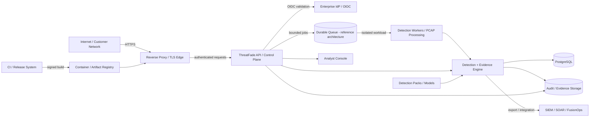

# ThreatFade Security Architecture

**Status:** Group 1 / Build 15 — complete baseline  
**Version:** 1.1  
**Scope:** ThreatFade v0.4.x repository and reference deployment architecture  
**Security target:** OWASP ASVS 5.0 Level 2 as the default application-security baseline, with Level 3 controls adopted where ThreatFade's security-monitoring, evidence, ingestion, or multi-tenant risk justifies them.

## 1. Purpose

This document defines ThreatFade's security architecture, trust boundaries, security invariants, principal classes, data flows, security responsibilities, and architectural assumptions. It is the normative companion to `docs/THREAT_MODEL.md` and `docs/ASVS_5.0_MATRIX.md`.

ThreatFade is a security-sensitive detection and investigation platform. The most important security property is not merely confidentiality of the API; it is **integrity of detections and evidence under hostile input and hostile tenancy**.

## 2. Security objectives

1. Prevent unauthenticated or unauthorized execution of protected operations in production.
2. Prevent cross-tenant data access and tenant-context substitution.
3. Treat PCAP, network signals, detection packs, model artifacts, and integration payloads as untrusted or security-sensitive inputs unless explicitly trusted.
4. Preserve the integrity, provenance, and auditability of detections and evidence.
5. Bound resource consumption so hostile input cannot trivially exhaust API, parser, worker, or database resources.
6. Ensure security failures fail closed at authentication and authorization boundaries.
7. Make security controls testable and traceable to requirements.
8. Preserve offline/air-gapped operation without weakening the core security model.
9. Maintain a verifiable software supply chain from source revision to release artifact.

## 3. Security zones and trust boundaries



### Trust boundaries

| ID | Boundary | Untrusted input | Required control family |
|---|---|---|---|
| TB-01 | Customer/client → edge/API | HTTP headers, body, auth tokens, files | TLS, authentication, validation, rate limits, request limits |
| TB-02 | API → identity provider | discovery/JWKS/token metadata | issuer/audience validation, algorithm allowlist, time validation, bounded network calls |
| TB-03 | API → detection workload | signals, scenario names, PCAP jobs | schema validation, resource limits, worker isolation, timeouts |
| TB-04 | PCAP parser → detection engine | packet structures and payload-derived values | parser isolation, bounded parsing, normalization, provenance |
| TB-05 | Tenant context → persistence | tenant identifiers and authorization claims | server-derived tenant context, authorization, database RLS in enterprise deployment |
| TB-06 | Detection engine → integrations | generated exports and outbound destinations | explicit allowlists, egress policy, output validation |
| TB-07 | Detection/model packs → runtime | rule/model artifacts | signing, approval, provenance, compatibility validation |
| TB-08 | Source/CI → release artifact | source, dependencies, build configuration | protected branches, dependency controls, SBOM, provenance, signing |
| TB-09 | Analyst console → API | analyst-controlled actions and display values | authorization, output encoding, CSRF/session controls where applicable |
| TB-10 | API → browser/dashboard rendering | detection/evidence text, tenant data, analyst-controlled values | server-side authorization, contextual output encoding, safe DOM rendering, CSP/security headers |

## 4. Security principals

| Principal | Trust level | Allowed authority |
|---|---|---|
| Anonymous client | Untrusted | Public health/version metadata only where exposed |
| Tenant viewer | Authenticated | Read tenant-scoped detections/cases |
| Tenant analyst | Authenticated | Run detections, inspect evidence, manage cases according to role |
| Tenant admin | Authenticated | Tenant administration within its tenant boundary |
| Platform admin | Highly privileged | Explicit cross-tenant operational administration; every action must be auditable |
| API/service identity | Machine principal | Explicitly scoped service permissions; no implicit human privileges |
| Detection worker | Constrained workload identity | Process assigned jobs; no broad control-plane authority |
| CI/release identity | Build principal | Produce and attest artifacts; no runtime tenant access |

## 5. Protected assets

- Detection results and analyst dispositions.
- Raw and derived evidence.
- Uploaded PCAP/PCAPNG and normalized signal data.
- Tenant identity and configuration.
- OIDC/JWT validation material and service credentials.
- Detection packs and model artifacts.
- Audit events and investigation timelines.
- Exported SIEM/STIX/Sigma artifacts.
- Database records and backup material.
- Release artifacts, SBOMs, attestations, and signing metadata.

## 6. Data classification

| Class | Examples | Default handling |
|---|---|---|
| C0 Public | version, public documentation | public |
| C1 Operational | aggregate health/metrics | authenticated/operational |
| C2 Sensitive telemetry | detections, evidence, case data | tenant-scoped, encrypted at rest/in transit |
| C3 Restricted security material | PCAP, credentials, model/detection signing material, audit data | least privilege, explicit retention, restricted export |

The classification is a technical baseline, not a legal classification. Customer contracts, regulatory requirements, and data-residency obligations may impose stricter controls.

## 7. Security invariants

These are architecture-level properties and must be continuously tested.

### SI-01 — Authentication boundary
Production protected operations require a valid configured identity boundary. Missing or invalid identity configuration fails closed.

### SI-02 — Tenant authority
A client-controlled tenant identifier can never grant authority over a different tenant. Tenant authority is derived from authenticated identity and server-side authorization.

### SI-03 — Privilege separation
Platform-wide privileges are distinct from tenant-scoped privileges and require explicit role assignment.

### SI-04 — Untrusted file handling
Uploaded PCAP/PCAPNG content is data, never executable content. Parsing occurs under bounded resource controls and must not inherit arbitrary client filenames as filesystem paths.

### SI-05 — Evidence integrity
A detection must retain enough provenance to reconstruct the input source, detection rule/version, engine version, configuration, and evidence used to produce it.

### SI-06 — Audit integrity
Security-sensitive authorization, detection, export, administrative, and configuration actions produce structured audit events. The production implementation must provide tamper evidence and durable centralized retention.

### SI-07 — Fail closed
Authentication, authorization, tenant isolation, pack verification, and other security boundaries fail closed. Optional enrichment may degrade without disabling core detection, but the degradation is observable.

### SI-08 — Bounded processing
Every externally controllable resource-intensive operation has explicit bounds for size, count, time, memory, concurrency, or rate.

### SI-09 — Supply-chain integrity
Production artifacts are traceable to source and verified build provenance, with SBOM and cryptographic signing/attestation.

### SI-10 — Secrets non-disclosure
Credentials, tokens, raw PCAP payloads, and restricted evidence are never emitted to application logs or public telemetry.

## 8. Reference request/data flows

### 8.1 API detection

```text
Client
  → TLS edge
  → authentication
  → authorization
  → server-derived tenant context
  → input validation
  → detection engine
  → evidence/provenance
  → durable tenant-scoped record
  → audit event
  → response/export
```

### 8.2 PCAP detection

```text
Client
  → bounded upload
  → temporary/quarantined storage
  → isolated parser worker
  → normalized signals
  → detection engine
  → evidence/provenance
  → durable record
  → audit
```

### 8.3 Release

```text
Protected source
  → CI checks
  → dependency/security checks
  → build
  → SBOM
  → provenance/attestation
  → signature
  → registry
  → deployment verification
```

## 9. Security responsibilities

### Application

- Authentication and authorization decisions.
- Input validation and output encoding.
- Tenant-context enforcement.
- Audit event generation.
- Detection provenance.
- Safe handling of integration destinations.

### Deployment operator

- TLS and edge controls.
- Secret management.
- PostgreSQL encryption, HA, backups and recovery.
- Immutable audit/evidence storage.
- Network segmentation and egress controls.
- Runtime resource limits.
- Identity-provider configuration.

### CI/release system

- Protected branch policy.
- Dependency scanning.
- Secret scanning.
- SBOM/provenance/attestation.
- Artifact signing.
- Release verification.

## 10. High-risk design decisions

| Decision | Rationale | Residual risk |
|---|---|---|
| PostgreSQL is production reference storage | Durable relational tenancy and investigation state | HA/backup/RLS remain deployment requirements until implemented/tested |
| PCAP parsing is a separate security boundary | Network captures are attacker-controlled data | Current synchronous reference path still needs worker sandboxing |
| OIDC is externalized | Enterprise identity belongs at the customer's trust boundary | Provider misconfiguration remains an operational risk |
| Detection packs are versioned | Detection behavior must be reproducible | Signing/registry/canary lifecycle is still a follow-on build |
| OpenTelemetry is optional | Supports enterprise observability without hard dependency | Production telemetry policy must be enforced by operators |

## 11. Security design rules for future changes

Any change that modifies one of the following requires a threat-model review before merge:

- authentication or authorization
- tenant identity or persistence
- PCAP/network parsing
- outbound integrations
- detection/model execution
- file handling
- secrets/configuration
- audit/evidence handling
- release/build workflows
- new externally reachable API endpoints

The review must answer the four OWASP threat-modeling questions: what are we building, what can go wrong, what are we going to do about it, and did we do a good enough job? urlOWASP Threat Modeling Cheat Sheethttps://cheatsheetseries.owasp.org/cheatsheets/Threat_Modeling_Cheat_Sheet.html

## 12. Assurance boundary

This architecture is an engineering baseline. It does not represent SOC 2, ISO 27001, Common Criteria, regulatory approval, third-party penetration testing, or customer-scale assurance. Those require independent and operational evidence.
