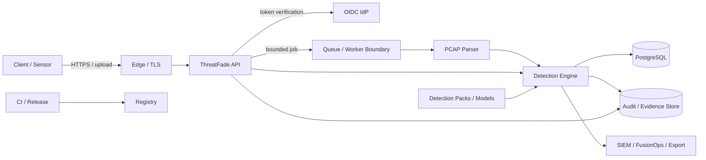

# ThreatFade Threat Model

**Version:** 2.0  
**Scope:** ThreatFade v0.4.x application, detection data plane, control plane, reference deployment and release pipeline  
**Method:** system decomposition + data-flow/trust-boundary analysis + STRIDE + abuse cases + security invariants  
**Review cadence:** every security-boundary change and at least once per release train

## 1. What are we building?

ThreatFade is an evidence-first detection and investigation platform. It accepts network/signal inputs, extracts features, evaluates fade-detection logic, optionally invokes ML anomaly detection, creates structured evidence, persists tenant-scoped results, exposes investigation APIs, and exports to operational security systems.

The repository also contains a dashboard, enterprise identity/authorization primitives, persistence, audit events, detection packs, integrations, container/release automation, and validation tooling.

## 2. Assets

| ID | Asset | Classification | Integrity priority | Confidentiality priority |
|---|---|---|---|---|
| A-01 | Detection results | C2 | Critical | High |
| A-02 | Evidence/provenance | C2/C3 | Critical | High |
| A-03 | PCAP/PCAPNG uploads | C3 | High | Critical |
| A-04 | Tenant identity/configuration | C2 | Critical | High |
| A-05 | OIDC/JWT validation material | C3 | Critical | High |
| A-06 | Audit events | C3 | Critical | High |
| A-07 | Detection packs | C3 | Critical | Medium |
| A-08 | ML/model artifacts | C3 | Critical | Medium |
| A-09 | Database/backups | C3 | Critical | Critical |
| A-10 | Integration credentials | C3 | Critical | Critical |
| A-11 | Release artifacts/SBOM/provenance | C2/C3 | Critical | Medium |
| A-12 | Analyst cases/dispositions | C2 | High | High |

## 3. Actors

| Actor | Trust | Objective |
|---|---|---|
| Internet attacker | Untrusted | exploit API, upload parser abuse, resource exhaustion |
| Malicious authenticated user | Low | cross-tenant access, privilege abuse, evidence manipulation |
| Compromised tenant | Low | abuse integrations, exfiltrate data, poison detection inputs |
| Malicious detection-pack author | Untrusted | alter detection behavior or exploit runtime |
| Malicious/compromised model source | Untrusted | model poisoning or integrity bypass |
| Compromised integration endpoint | Untrusted | SSRF/egress abuse, data exfiltration |
| Compromised dependency | Untrusted | supply-chain compromise |
| Malicious insider/admin | Privileged but adversarial | misuse administrative authority |
| Compromised CI identity/runner | High impact | alter release artifact or provenance |
| Malicious customer network source | Untrusted | adversarial traffic designed to evade detection or crash parsing |

## 4. Trust boundaries

| ID | From → To | Main risk |
|---|---|---|
| TB-01 | Internet/client → edge/API | injection, auth bypass, request smuggling, resource exhaustion |
| TB-02 | API → IdP/JWKS | token-validation compromise, SSRF, stale keys |
| TB-03 | API → detection workload | hostile signal arrays, CPU/memory exhaustion |
| TB-04 | PCAP → parser | parser vulnerabilities, malformed packet structures, decompression/resource abuse |
| TB-05 | Principal → tenant context | cross-tenant authorization failure |
| TB-06 | Application → database | injection, unauthorized reads/writes, tenant leakage |
| TB-07 | Application → external integration | SSRF, credential leakage, data exfiltration |
| TB-08 | Detection/model packs → runtime | code execution, poisoned logic/model, incompatible artifacts |
| TB-09 | Source/CI → release | supply-chain tampering |
| TB-10 | API → dashboard/browser | XSS, unsafe DOM use, sensitive data exposure |

## 5. System data flows

## 6. STRIDE analysis

| Threat | Component(s) | Example | Impact | Primary response |
|---|---|---|---|---|
| Spoofing | API/IdP | forged/incorrect JWT | Critical | strict OIDC validation, key rotation, issuer/audience/algorithm checks |
| Spoofing | service identities | stolen integration credential | Critical | scoped identities, rotation, secret manager |
| Tampering | detection records | alter evidence after alert | Critical | append-only/tamper-evident audit, provenance, integrity hashes |
| Tampering | detection packs | unsigned malicious rule | Critical | signed/approved packs, registry, compatibility checks |
| Repudiation | admin/API | deny sensitive action | High | structured audit with request/correlation IDs and durable retention |
| Information disclosure | tenancy | query another tenant | Critical | server-side tenant authority, authorization, database RLS in enterprise deployment |
| Information disclosure | PCAP/evidence | export restricted telemetry | Critical | least privilege, export authorization, retention, encryption |
| Denial of service | PCAP parser | pathological capture | Critical | bounded upload, worker isolation, CPU/memory/time quotas |
| Denial of service | API | request flood | High | edge + application rate limiting, concurrency limits |
| Elevation of privilege | RBAC | tenant role gains platform authority | Critical | deny-by-default permission model, explicit platform role |
| Elevation of privilege | integrations | SSRF reaches privileged service | Critical | egress allowlists, protocol/host/port controls |
| Supply chain | CI/release | compromised action/dependency | Critical | dependency scanning, provenance, SBOM, signing, protected release |
| Model poisoning | ML | compromised model artifact | High | signed model, provenance, validation, rollback |
| XSS | dashboard | malicious evidence rendered as HTML | High | contextual output encoding, safe DOM APIs, CSP |

## 7. Risk register

Risk score uses **Likelihood (1–5) × Impact (1–5)**. Scores 15–25 are Critical, 8–14 High, 4–7 Medium, and 1–3 Low.

| ID | Risk | L | I | Score | Current status | Required treatment |
|---|---|---:|---:|---:|---|---|
| R-01 | Cross-tenant data leakage | 3 | 5 | 15 | Mitigated in application; DB RLS pending | Add PostgreSQL RLS and isolation tests |
| R-02 | Malicious PCAP causes resource exhaustion | 4 | 5 | 20 | Partially mitigated | Isolated async parser workers with hard CPU/memory/time limits |
| R-03 | Audit/evidence tampering | 3 | 5 | 15 | Partially mitigated | Durable immutable/tamper-evident audit/evidence store |
| R-04 | Detection provenance insufficient for investigation | 3 | 5 | 15 | Partial | Add rule/engine/model/config/input provenance |
| R-05 | OIDC/JWKS endpoint abuse | 2 | 5 | 10 | Partially mitigated | Harden discovery/JWKS network boundary and cache behavior |
| R-06 | Malicious detection pack | 3 | 5 | 15 | Partial | Signed registry, schema validation, sandboxed execution model |
| R-07 | Integration SSRF/egress abuse | 3 | 5 | 15 | Partial | Explicit destination allowlists and network egress policy |
| R-08 | Supply-chain compromise | 2 | 5 | 10 | Strong baseline | Immutable action pinning, artifact verification at deployment |
| R-09 | ML failure silently reduces detection capability | 3 | 4 | 12 | Known | Explicit degraded state, model health/provenance |
| R-10 | Database failure/data loss | 2 | 5 | 10 | Deployment-dependent | HA, PITR, restore drills |
| R-11 | Dashboard XSS | 2 | 4 | 8 | Mitigations present | Automated browser/security regression coverage |
| R-12 | Privileged insider abuse | 2 | 5 | 10 | Partial | privileged-action audit, dual control for sensitive changes |

## 8. Security invariants

- **SI-01:** Protected production operations require valid authentication.
- **SI-02:** Tenant authority is derived from authenticated identity, not a client-selected header/body field.
- **SI-03:** Cross-tenant access is denied unless an explicit platform-level authorization exists.
- **SI-04:** Uploaded files remain non-executable data and are processed under resource bounds.
- **SI-05:** Security-sensitive actions are auditable.
- **SI-06:** Detection results preserve sufficient provenance for reproducibility.
- **SI-07:** Security boundaries fail closed.
- **SI-08:** Every externally controlled resource-intensive path has explicit limits.
- **SI-09:** Release artifacts are traceable to source and cryptographically verifiable.
- **SI-10:** Secrets and restricted telemetry are excluded from ordinary logs.

## 9. Abuse cases requiring continuous regression tests

### Authentication and authorization

- Missing bearer token in production.
- Invalid issuer/audience.
- Expired token.
- Unknown `kid`.
- Unsupported signing algorithm/key type.
- Token without `sub`, `exp`, `iat`, or tenant claim.
- Viewer attempting detection execution.
- Tenant user supplying another tenant ID.
- Tenant admin attempting platform-wide action.
- API-only identity attempting analyst-only case operations.

### Ingestion and parsing

- Oversized upload.
- Wrong extension/content type.
- Malformed PCAP/PCAPNG.
- Truncated capture.
- Extremely long packet/signal sequences.
- High packet-count capture.
- Slow/partial upload.
- Path traversal filename.
- Parser exception/crash.
- Resource exhaustion.

### Data and evidence

- SQL injection payloads.
- Export authorization bypass.
- Cross-tenant detection enumeration.
- Audit file corruption/tampering.
- Evidence modification after case creation.

### Integrations

- Internal/private IP target.
- Loopback target.
- Redirect to disallowed destination.
- Unsupported protocol.
- Credential leakage in errors/logs.
- Oversized integration response.

### Supply chain

- Dependency with known vulnerability.
- Unsigned release artifact.
- Mismatched provenance subject/digest.
- Modified detection pack.
- Untrusted model artifact.

## 10. Mitigation tracking

| Control | Source of truth | Verification |
|---|---|---|
| Threat model | this document | security architecture review |
| ASVS requirements | `docs/ASVS_5.0_MATRIX.md` | CI/documentation validation + security tests |
| Security architecture | `docs/SECURITY_ARCHITECTURE.md` | ADR/threat-model review |
| Detection pack integrity | `core/detection_pack.py` and future registry | pack validation/signature tests |
| Tenant authorization | `core/enterprise.py`, enterprise routes | authorization regression tests |
| Input/resource bounds | `core/api_security.py`, API | abuse-case tests |
| Supply chain | `.github/workflows/security.yml`, `release.yml` | CI/security gates |

## 11. Review triggers

Review this model before merging any change involving authentication, authorization, tenancy, PCAP parsing, detection/model execution, outbound integrations, file handling, secrets, audit/evidence, persistence, new external endpoints, or CI/release security.

Threat modeling is a continuous SDLC activity rather than a one-time document. urlOWASP Threat Modeling Cheat Sheethttps://cheatsheetseries.owasp.org/cheatsheets/Threat_Modeling_Cheat_Sheet.html

## 12. Residual risk statement

ThreatFade's repository can implement technical controls, but it cannot self-certify external assurance. Independent penetration testing, independent detection validation, customer-scale performance validation, contractual SLAs, data-residency commitments, and organization-level incident response remain external assurance activities.
